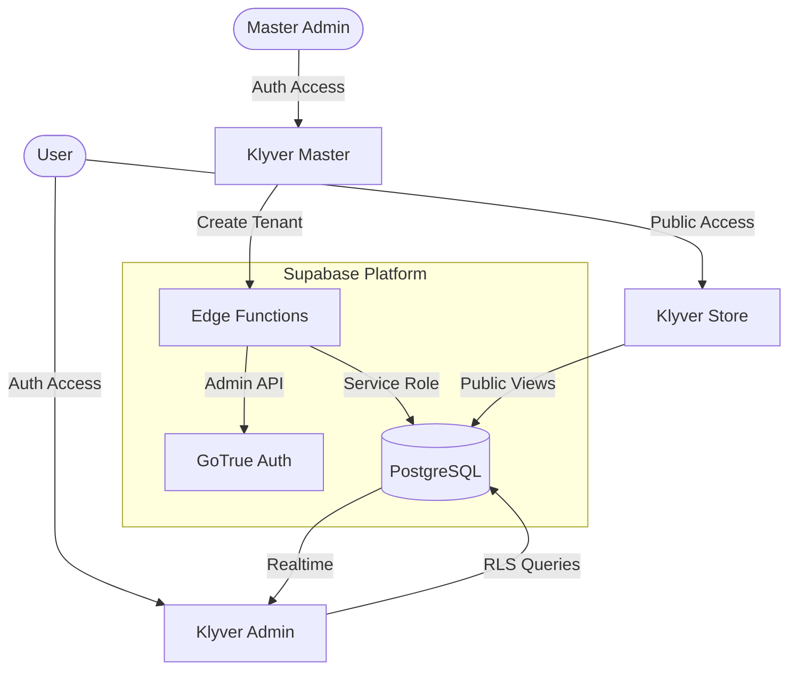

# Architecture Overview

## Data Flow
1. **Creation:** Master calls `create-tenant` edge function.
2. **Provisioning:** Edge function creates Tenant record, Auth User, and Profile atomically (simulated).
3. **Access:** Admin logs in. RLS policies ensure they only see their Tenant's data.
4. **Public:** Store uses anonymous access restricted to `tenants_public` view and specific product columns.
